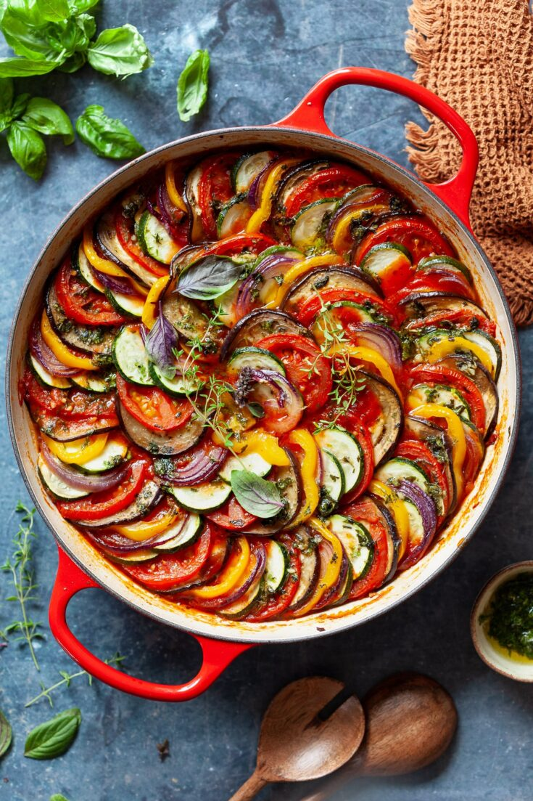
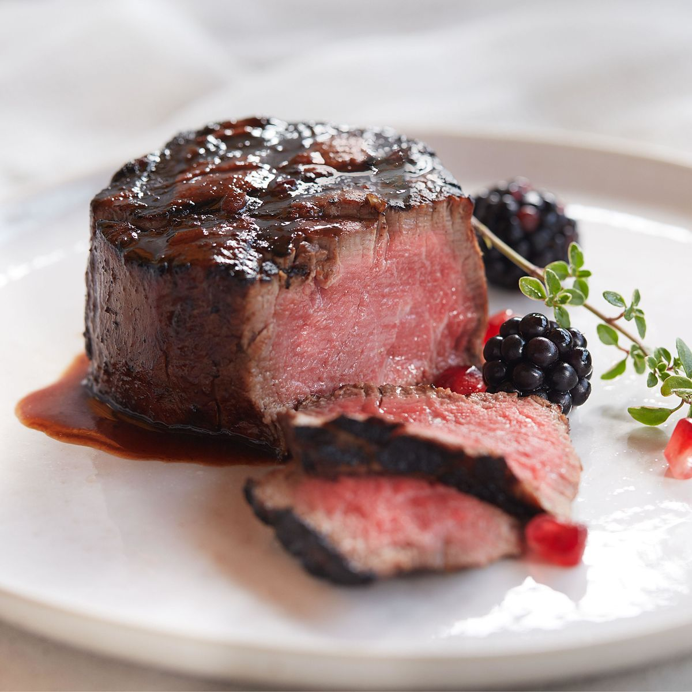
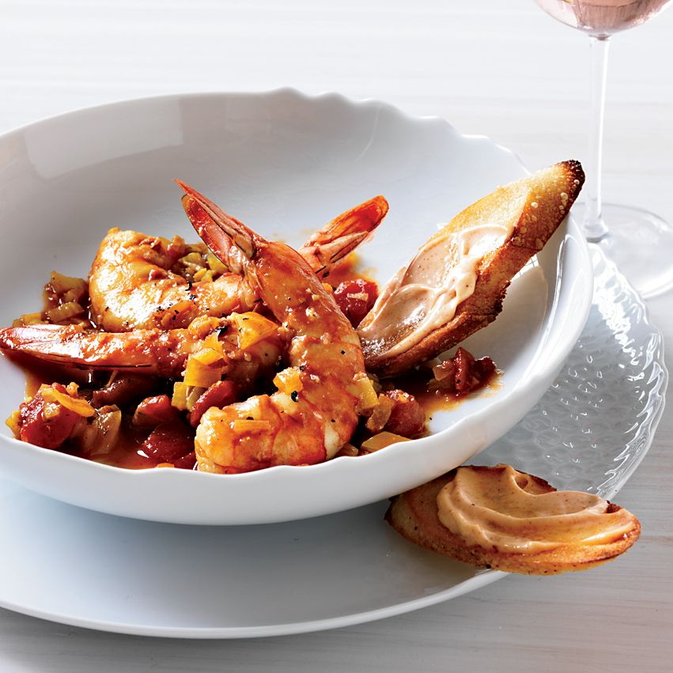
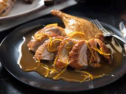
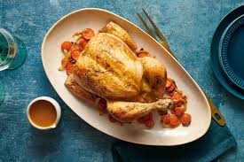

## Menu
[entree](#Entree) | ... | [Beverages](#beverages)

## Japanese Food

| Name                                        | Description                                                                                       |                                                                 | Price |
|:--------------------------------------------|:--------------------------------------------------------------------------------------------------|-----------------------------------------------------------------|------:|
| **Ratatouille**                             | A classic French vegetable stew with tomatoes, zucchini, peppers, onions, and eggplant.           |  |    99 |
| **Steak au Poivre with Red Wine Pan Sauce** | A pepper-crusted steak served with a rich, savory red wine sauce.                                 |               |   120 |
| **Marseille-Style Shrimp Stew**             | A hearty shrimp stew with garlic and a French rouille served on toasted baguette slices.          |               |   115 |
| **Duck à l'Orange**                         | Roasted duck served with a tangy orange sauce, offering a sweet and savory flavor combination.    |               |   140 |
| **Julia Child's Favorite Roast Chicken**    | Roast chicken with butter, lemon, and herbs for a juicy, flavorful meal.                          |  |   110 |
