## Menu

[Appetizer](#appetizer) | [Salad](#salad) | ...|[Dessert](#Dessert) |  [Beverages](#beverages)

## Appetizer
| Name                    | Description                                                                                                                                                               | Image                                                    | Price |
|:------------------------|---------------------------------------------------------------------------------------------------------------------------------------------------------------------------|----------------------------------------------------------|------:|
| **Aïoli Provençal**     | French condiment alongside fresh veggies, seafood, or even frites.                                                                                                        | 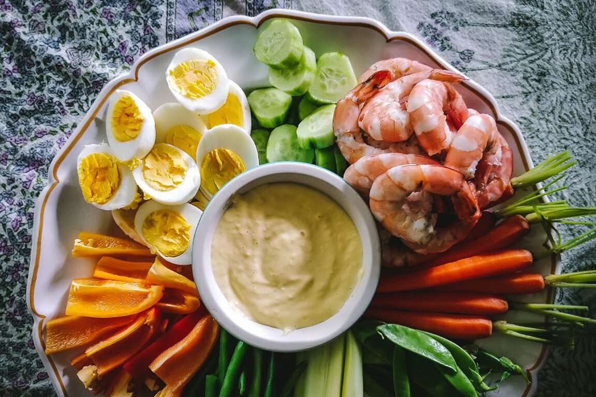 |    80 |
| **Brandade**            | Mashed potatoes and salt cod come together to create a creamy, pleasantly salty dip that’s best enjoyed with seasonal crudités or your favorite crackers or crusty bread. | 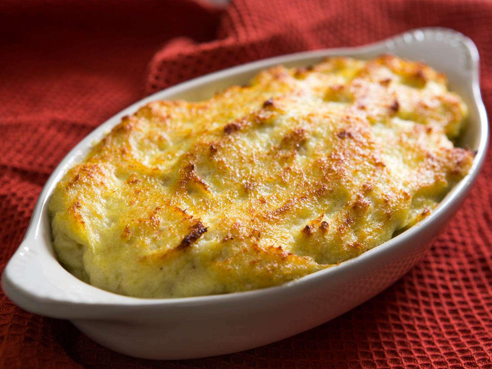    |   150 |
| **Carrot Crêpes**       | A colorful and vegetal take on the classic crêpe, these thin, alluring pancakes will impress your party guests with their subtle sweetness and sunny orange hue.          | 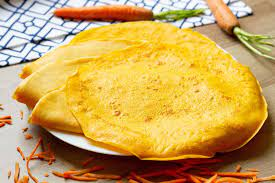      |   100 |
| **Duck Pâté en Croûte** | Flaky homemade pastry dough and top it with a flavorful gelée                                                                                                             | 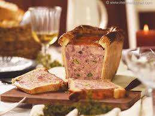        |   200 |

## Salad
 

| Name                        | Description                                                                                                                                                                                                                                                                                                                                                                                             |                                          | Price |
|:----------------------------|---------------------------------------------------------------------------------------------------------------------------------------------------------------------------------------------------------------------------------------------------------------------------------------------------------------------------------------------------------------------------------------------------------|------------------------------------------|------:|
| **Salade de figues**        | Salade de figues is a traditional French salad originating from the region of Languedoc. The salad is usually made with a combination of ripe figs, endive, onions, lemon juice, olive oil, red wine vinegar, salt, pepper, and sugar. The figs are cut into quarters, and then eighths.                                                                                                                | 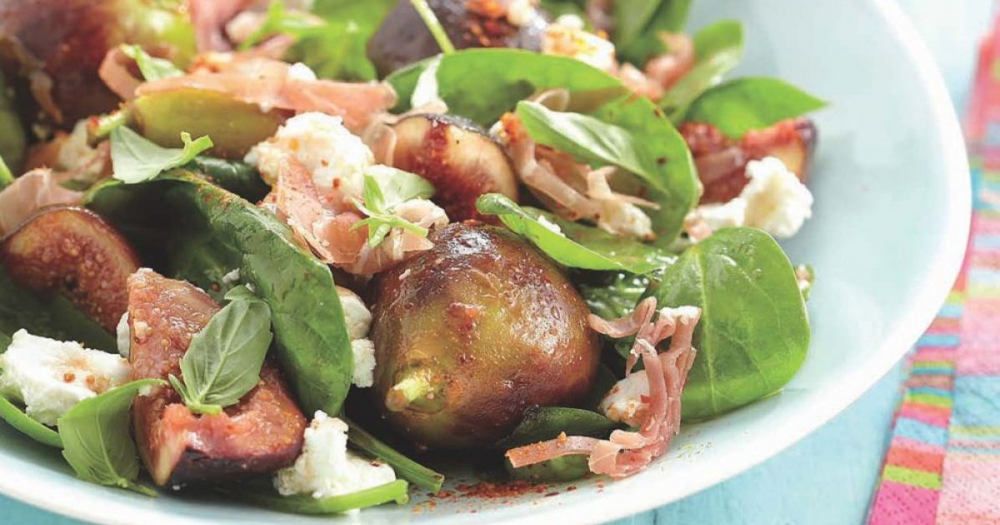 |   110 |
| **Salade de poulpe**        | Salade de poulpe is a traditional French octopus salad originating from Languedoc. The salad is usually made with a combination of tenderized octopus, potatoes, white wine, onions, fennel, capers, parsley, paprika, salt, pepper, olive oil, and lemon juice.                                                                                                                                        | 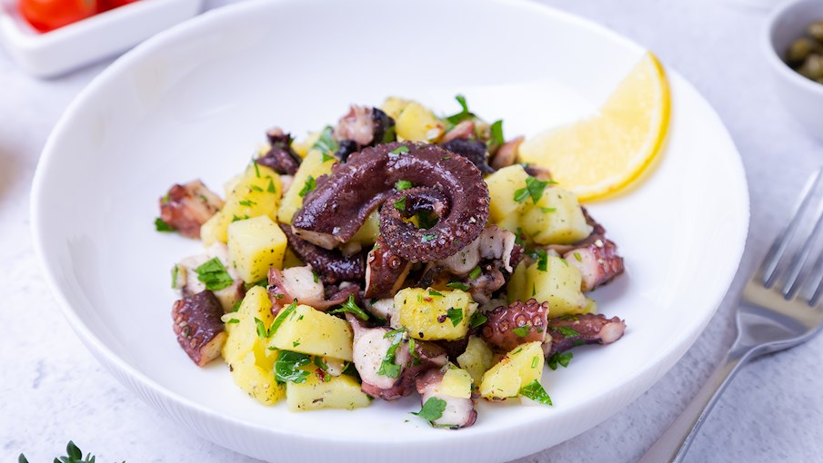 |   120 |
| **Salade de saucisse**      | Wurstsalat is a traditional salad from Germany (especially southern parts), Switzerland, Austria, and Alsace in France made with strips of sausage. It's a popular dish often consumed as a light meal in beer gardens or traditional inns, especially during the warm summer months.                                                                                                                   | 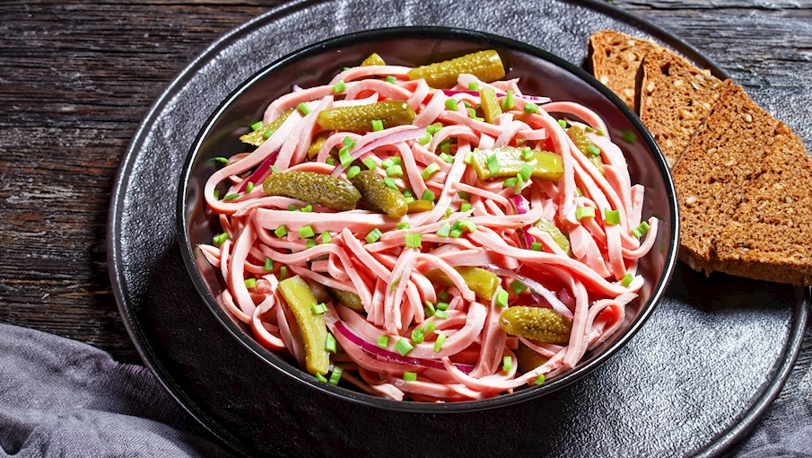 |   100 |
| **Salade Landaise**         | Salade Landaise is a traditional French salad originating from the Landes area, famous for its duck and walnuts. The salad is beloved for its contrast of temperatures of the ingredients. It's made with duck breast, gizzards or confit, lettuce leaves, bacon, cherry tomatoes, walnuts, and croutons.                                                                                               | 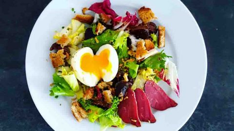 |   120 |
| **Salade Lyonnaise**        | Salade Lyonnaise consists of endive, bacon, croutons, and a poached egg that is placed on top of it. It originates from the French city of Lyon, and it is one of the most popular salads found on the menus of numerous small French bistros and restaurants.                                                                                                                                          | 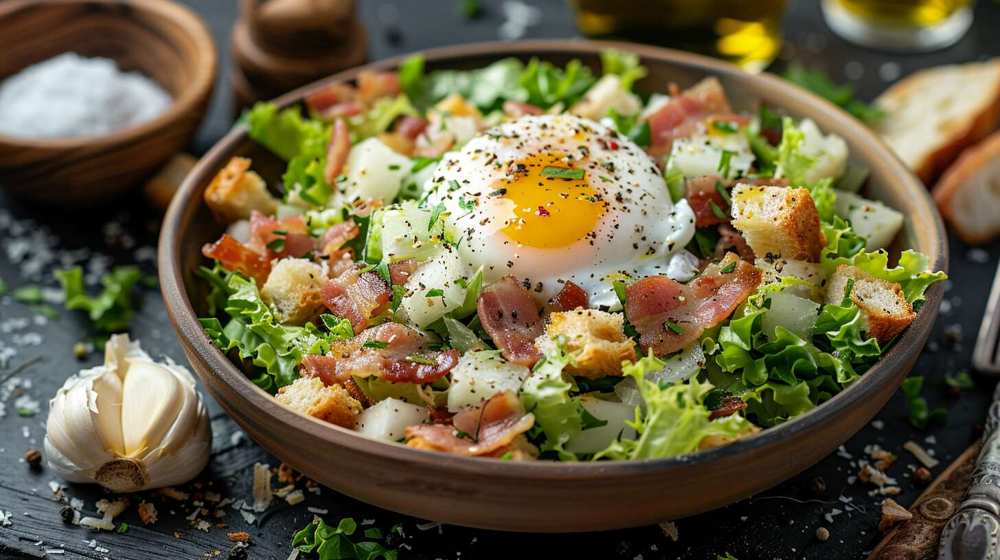 |   130 |

## Dessert
| Name                                                                          | Description                                                                                                                                                                                                                                                                                                                                    |                                          | Price |
|-------------------------------------------------------------------------------|:-----------------------------------------------------------------------------------------------------------------------------------------------------------------------------------------------------------------------------------------------------------------------------------------------------------------------------------------------|------------------------------------------|-------|
| Chocolate éclairs                                                             | It is a pastry made with choux dough filled with a cream and topped with a flavored icing.                                                                                                                                                                                                                                                     | 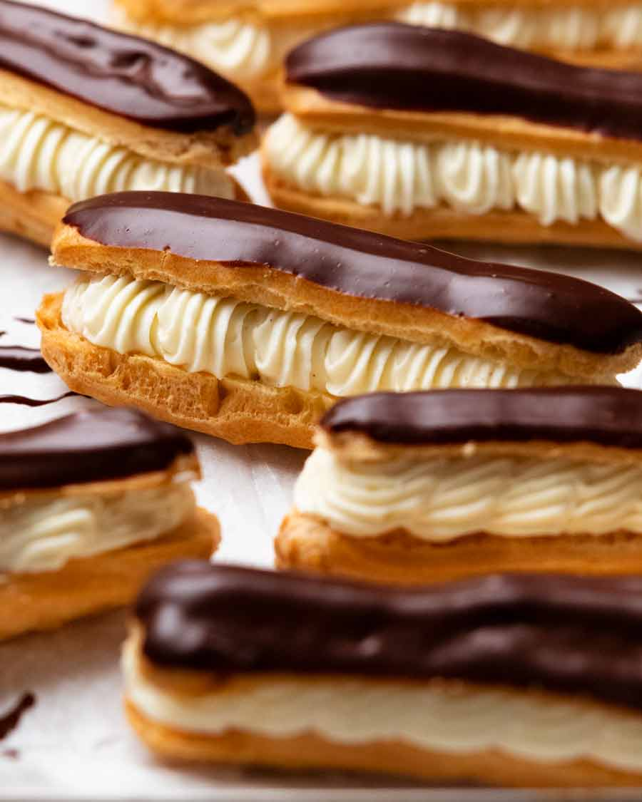     |   140 | 
| Floating Islands with Dark Chocolate Crème Anglaise and Toasted Pistachios    | The rich, deep chocolate flavor contrasts with the incredibly light and airy texture of this classic French dessert.                                                                                                                                                                                                                           | 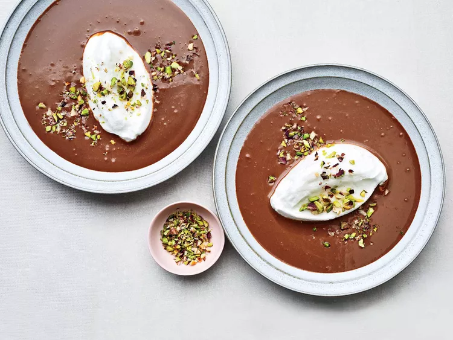    |   150 | 
| Lemon and lime tart                                                           | The perfect make-ahead French pud and similar to a classic tarte au citron – recreate Edd Kimber's epic lemon and lime tart with a coconut macaroon case and fill with a citrussy curd.                                                                                                                                                        | 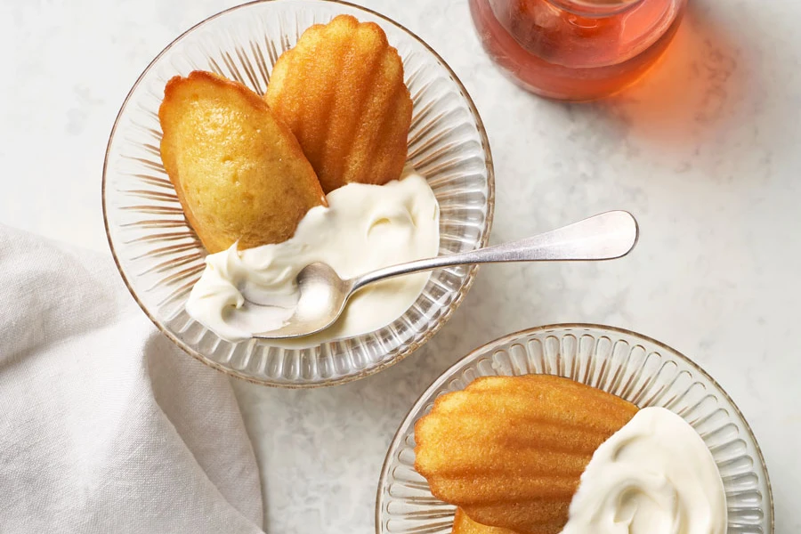  |   180 |       
| Pain au chocolat                                                              | Pain au chocolat are made using a leavened, laminated dough. This means the dough is activated with yeast to create a rise, but it is also enriched with layers of butter that trap air during the baking process, creating the classic web of gluten strands and light, buttery texture you find in croissants.                               | 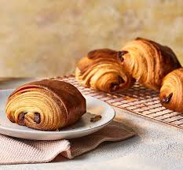    |   100 |    
| Tarte Tatin                                                                   | Tarte Tatin is a French dessert for which apples are caramelized in a skillet with butter and sugar, then topped with a round of pastry dough and baked. Tarte Tatin was named for Stéphanie and Caroline Tatin, who created it at the Hôtel Tatin in Lamotte-Beuvron, France, in the 1880s.                                                   | 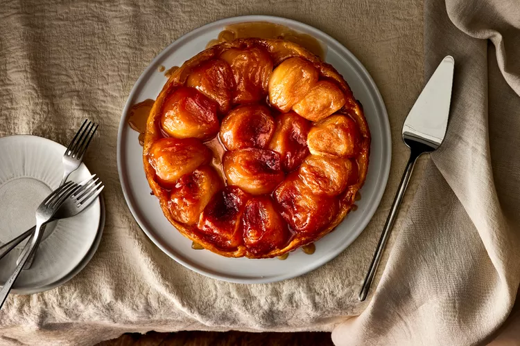 |   160 | 
| Raspberry Macarons                                                            | These are among the simplest classic French macarons, made with only sugar, almond flour, egg whites, red food coloring — and a filling of raspberry jam.                                                                                                                                                                                      |     |   120 |

## Beverages
