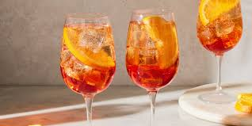
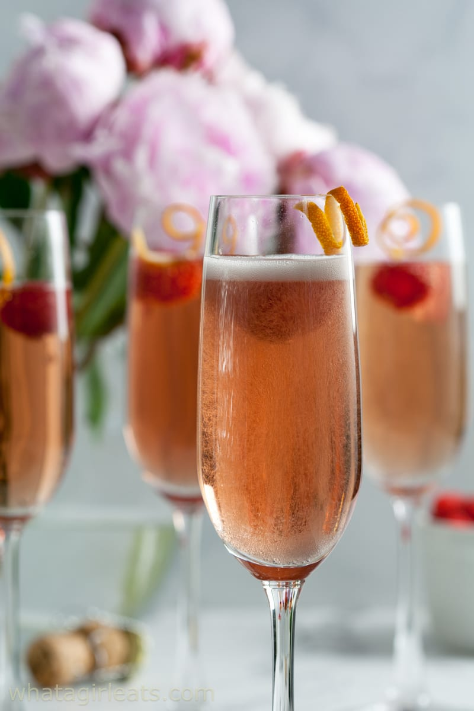
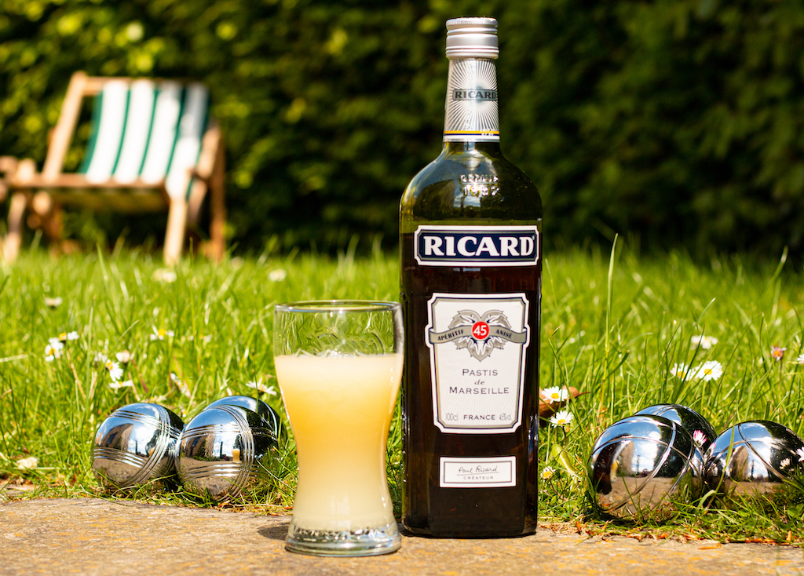
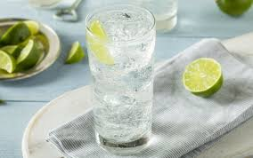

## Menu

[Appetizer](#appetizer) | [soup](#Soup) | [Salad](#salad) | |[Dessert](#Dessert) | [entree](#Entree)| [Beverages](#beverages)

## Appetizer
| Name                    | Description                                                                                                                                                               | Image                                                    | Price |
|:------------------------|---------------------------------------------------------------------------------------------------------------------------------------------------------------------------|----------------------------------------------------------|------:|
| **Aïoli Provençal**     | French condiment alongside fresh veggies, seafood, or even frites.                                                                                                        |  |    80 |
| **Brandade**            | Mashed potatoes and salt cod come together to create a creamy, pleasantly salty dip that’s best enjoyed with seasonal crudités or your favorite crackers or crusty bread. |     |   150 |
| **Carrot Crêpes**       | A colorful and vegetal take on the classic crêpe, these thin, alluring pancakes will impress your party guests with their subtle sweetness and sunny orange hue.          |       |   100 |
| **Duck Pâté en Croûte** | Flaky homemade pastry dough and top it with a flavorful gelée                                                                                                             |         |   200 |

## Soup
| Name                              | Description                                                                                                              |                                               | Price |
|:----------------------------------|:-------------------------------------------------------------------------------------------------------------------------|-----------------------------------------------|------:|
| **French Onion Soup**             | A rich and savory soup with caramelized onions, topped with melted cheese and served with crusty bread.                  |  |   120 |
| **Creamy Butternut Squash Soup**  | A velvety blend of roasted butternut squash, cream, and spices.                                                          |  |   110 |
| **Magical Leek Soup**             | A light and refreshing soup made with leeks, potatoes, and herbs.                                                        |  |    90 |
| **French Lentil Soup**            | A hearty and nutritious soup with green lentils, vegetables, and a touch of herbs.                                       |  |   100 |
| **Broccoli and Blue Cheese Soup** | A creamy soup with broccoli and tangy blue cheese for a bold taste.                                                      |  |   115 |
| **Fancy Cream of Cauliflower**    | A silky-smooth cauliflower soup garnished with fresh herbs and a drizzle of olive oil.                                   |  |   105 |
| **Ratatouille Soup**              | A chunky vegetable soup inspired by the classic French ratatouille.                                                      |  |   120 |

## Salad
 

| Name                        | Description                                                                                                                                                                                                                                                                                                                                                                                             |                                          | Price |
|:----------------------------|---------------------------------------------------------------------------------------------------------------------------------------------------------------------------------------------------------------------------------------------------------------------------------------------------------------------------------------------------------------------------------------------------------|------------------------------------------|------:|
| **Salade de figues**        | Salade de figues is a traditional French salad originating from the region of Languedoc. The salad is usually made with a combination of ripe figs, endive, onions, lemon juice, olive oil, red wine vinegar, salt, pepper, and sugar. The figs are cut into quarters, and then eighths.                                                                                                                |  |   110 |
| **Salade de poulpe**        | Salade de poulpe is a traditional French octopus salad originating from Languedoc. The salad is usually made with a combination of tenderized octopus, potatoes, white wine, onions, fennel, capers, parsley, paprika, salt, pepper, olive oil, and lemon juice.                                                                                                                                        |  |   120 |
| **Salade de saucisse**      | Wurstsalat is a traditional salad from Germany (especially southern parts), Switzerland, Austria, and Alsace in France made with strips of sausage. It's a popular dish often consumed as a light meal in beer gardens or traditional inns, especially during the warm summer months.                                                                                                                   |  |   100 |
| **Salade Landaise**         | Salade Landaise is a traditional French salad originating from the Landes area, famous for its duck and walnuts. The salad is beloved for its contrast of temperatures of the ingredients. It's made with duck breast, gizzards or confit, lettuce leaves, bacon, cherry tomatoes, walnuts, and croutons.                                                                                               |  |   120 |
| **Salade Lyonnaise**        | Salade Lyonnaise consists of endive, bacon, croutons, and a poached egg that is placed on top of it. It originates from the French city of Lyon, and it is one of the most popular salads found on the menus of numerous small French bistros and restaurants.                                                                                                                                          |  |   130 |

## Entree
| Name                                        | Description                                                                                       |                                                    | Price |
|:--------------------------------------------|:--------------------------------------------------------------------------------------------------|----------------------------------------------------|------:|
| **Ratatouille**                             | A classic French vegetable stew with tomatoes, zucchini, peppers, onions, and eggplant.           |  |    99 |
| **Steak au Poivre with Red Wine Pan Sauce** | A pepper-crusted steak served with a rich, savory red wine sauce.                                 |  |   120 |
| **Marseille-Style Shrimp Stew**             | A hearty shrimp stew with garlic and a French rouille served on toasted baguette slices.          |  |   115 |
| **Duck à l'Orange**                         | Roasted duck served with a tangy orange sauce, offering a sweet and savory flavor combination.    |  |   140 |
| **Julia Child's Favorite Roast Chicken**    | Roast chicken with butter, lemon, and herbs for a juicy, flavorful meal.                          |  |   110 |

## Dessert
| Name                                                                           | Description                                                                                                                                                                                                                                                                                                                                    |                                                        | Price |
|--------------------------------------------------------------------------------|:-----------------------------------------------------------------------------------------------------------------------------------------------------------------------------------------------------------------------------------------------------------------------------------------------------------------------------------------------|--------------------------------------------------------|------:|
| **Chocolate éclairs**                                                          | It is a pastry made with choux dough filled with a cream and topped with a flavored icing.                                                                                                                                                                                                                                                     |        |   140 | 
| **Floating Islands with Dark Chocolate Crème Anglaise and Toasted Pistachios** | The rich, deep chocolate flavor contrasts with the incredibly light and airy texture of this classic French dessert.                                                                                                                                                                                                                           |       |   150 | 
| **Lemon and lime tart**                                                        | The perfect make-ahead French pud and similar to a classic tarte au citron – recreate Edd Kimber's epic lemon and lime tart with a coconut macaroon case and fill with a citrussy curd.                                                                                                                                                        |     |   180 |       
| **Pain au chocolat**                                                           | Pain au chocolat are made using a leavened, laminated dough. This means the dough is activated with yeast to create a rise, but it is also enriched with layers of butter that trap air during the baking process, creating the classic web of gluten strands and light, buttery texture you find in croissants.                               |       |   100 |    
| **Tarte Tatin**                                                                | Tarte Tatin is a French dessert for which apples are caramelized in a skillet with butter and sugar, then topped with a round of pastry dough and baked. Tarte Tatin was named for Stéphanie and Caroline Tatin, who created it at the Hôtel Tatin in Lamotte-Beuvron, France, in the 1880s.                                                   |    |   160 | 
| **Raspberry Macarons**                                                         | These are among the simplest classic French macarons, made with only sugar, almond flour, egg whites, red food coloring — and a filling of raspberry jam.                                                                                                                                                                                      |       |   120 |

## Beverages
| Name              | Description                                                                                                                                                                                                                                                                                                          |                                              | Price |
|:------------------|----------------------------------------------------------------------------------------------------------------------------------------------------------------------------------------------------------------------------------------------------------------------------------------------------------------------|----------------------------------------------|------:|
| **Aperol Spritz** | Aperol is a bright orange, bittersweet apéritif liqueur with a low (11%) alcohol content. Aperol, like other apéritifs, is meant to stimulate the appetite and is typically consumed before dinner.                                                                                                                  |  |   900 |
| **Kir** | A classic French cocktail made with dry white wine and a splash of crème de cassis, a blackcurrant liqueur, offering a sweet and refreshing taste. |  |   250 |
| **Pastis**        | Pastis is a very popular anise-flavored liqueur in France, especially in the southern regions of Provence and the Côte d’Azur. It is served cold, making it the perfect summer drink. Pastis is typically consumed diluted with water, which turns the liquid from a clear color to a milky white. French people usually drink it in small glasses, and it is not uncommon for people to add more water or ice cubes as they go.|  | 1,200 | 
| **Sparkling Water**     | Sparkling Water is made by adding carbon dioxide gas to plain water, resulting in a bubbly drink that is both thirst-quenching, mineral-rich, and enjoyable.              |  |    40 |

