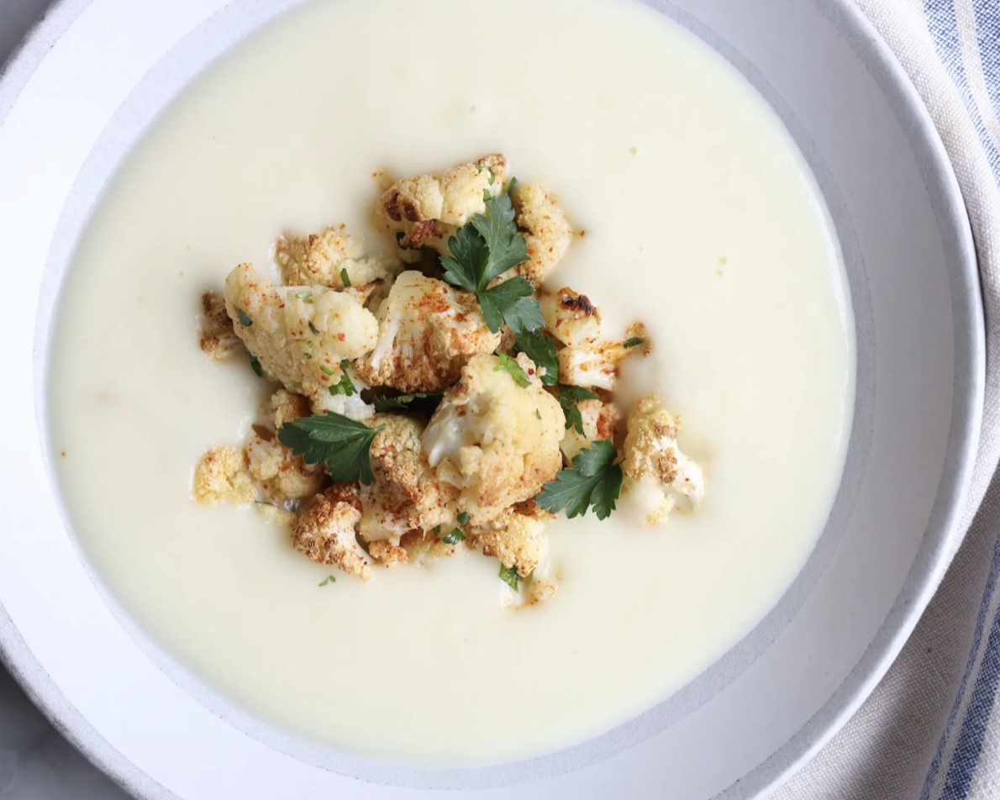

## Menu

[soup](#Soup) | ... | [Beverages](#beverages)

## Soup
| Name                                         | Description                                                                                                              |                                 | Price |
|:---------------------------------------------|:-------------------------------------------------------------------------------------------------------------------------|---------------------------------|------:|
| French Onion Soup                            | A rich and savory soup with caramelized onions, topped with melted cheese and served with crusty bread.                  |  |   120 |
| Creamy Butternut Squash Soup                 | A velvety blend of roasted butternut squash, cream, and spices.                                                          |  |   110 |
| Magical Leek Soup                            | A light and refreshing soup made with leeks, potatoes, and herbs.                                                        |  |    90 |
| French Lentil Soup                           | A hearty and nutritious soup with green lentils, vegetables, and a touch of herbs.                                       |  |   100 |
| Broccoli and Blue Cheese Soup                | A creamy soup with broccoli and tangy blue cheese for a bold taste.                                                      |  |   115 |
| Fancy Cream of Cauliflower                   | A silky-smooth cauliflower soup garnished with fresh herbs and a drizzle of olive oil.                                   |  |   105 |
| Ratatouille Soup                             | A chunky vegetable soup inspired by the classic French ratatouille.                                                      |  |   120 |

## Beverages

> A table of beverages. Each team member adds one beverage (one row) to the table.
> Result should be in alphabetical order by beverage name.
