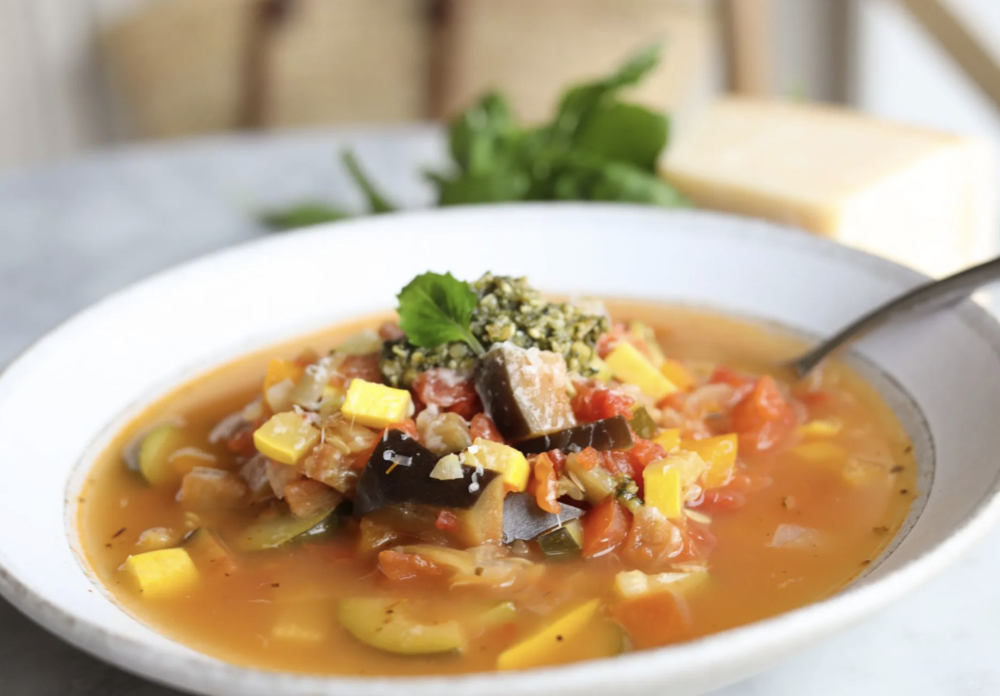

## Menu

[soup](#Soup) | ... | [Beverages](#beverages)

## Soup
| Name                              | Description                                                                                                              |                                               | Price |
|:----------------------------------|:-------------------------------------------------------------------------------------------------------------------------|-----------------------------------------------|------:|
| **French Onion Soup**             | A rich and savory soup with caramelized onions, topped with melted cheese and served with crusty bread.                  |  |   120 |
| **Creamy Butternut Squash Soup**  | A velvety blend of roasted butternut squash, cream, and spices.                                                          |  |   110 |
| **Magical Leek Soup**             | A light and refreshing soup made with leeks, potatoes, and herbs.                                                        |  |    90 |
| **French Lentil Soup**            | A hearty and nutritious soup with green lentils, vegetables, and a touch of herbs.                                       |  |   100 |
| **Broccoli and Blue Cheese Soup** | A creamy soup with broccoli and tangy blue cheese for a bold taste.                                                      |  |   115 |
| **Fancy Cream of Cauliflower**    | A silky-smooth cauliflower soup garnished with fresh herbs and a drizzle of olive oil.                                   |  |   105 |
| **Ratatouille Soup**              | A chunky vegetable soup inspired by the classic French ratatouille.                                                      |  |   120 |

## Beverages

> A table of beverages. Each team member adds one beverage (one row) to the table.
> Result should be in alphabetical order by beverage name.

| Name    | Description                                                                                                                                        |                                             | Price |
|:--------|:---------------------------------------------------------------------------------------------------------------------------------------------------|---------------------------------------------|------:|
| **Kir** | A classic French cocktail made with dry white wine and a splash of crème de cassis, a blackcurrant liqueur, offering a sweet and refreshing taste. |  |   250 |
