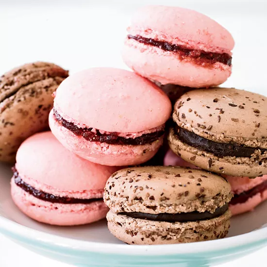

## Menu

[Dessert](#Dessert) | ... | [Beverages](#beverages)

## Dessert
| Name                                                                          | Description                                                                                                                                                                                                                                                                                                                                    |                                          | Price |
|-------------------------------------------------------------------------------|:-----------------------------------------------------------------------------------------------------------------------------------------------------------------------------------------------------------------------------------------------------------------------------------------------------------------------------------------------|------------------------------------------|-------|
| Chocolate éclairs                                                             | It is a pastry made with choux dough filled with a cream and topped with a flavored icing.                                                                                                                                                                                                                                                     |      |   140 | 
| Floating Islands with Dark Chocolate Crème Anglaise and Toasted Pistachios    | The rich, deep chocolate flavor contrasts with the incredibly light and airy texture of this classic French dessert.                                                                                                                                                                                                                           |     |   150 | 
| Lemon and lime tart                                                           | The perfect make-ahead French pud and similar to a classic tarte au citron – recreate Edd Kimber's epic lemon and lime tart with a coconut macaroon case and fill with a citrussy curd.                                                                                                                                                        |   |   180 |       
| Pain au chocolat                                                              | Pain au chocolat are made using a leavened, laminated dough. This means the dough is activated with yeast to create a rise, but it is also enriched with layers of butter that trap air during the baking process, creating the classic web of gluten strands and light, buttery texture you find in croissants.                               |     |   100 |    
| Tarte Tatin                                                                   | Tarte Tatin is a French dessert for which apples are caramelized in a skillet with butter and sugar, then topped with a round of pastry dough and baked. Tarte Tatin was named for Stéphanie and Caroline Tatin, who created it at the Hôtel Tatin in Lamotte-Beuvron, France, in the 1880s.                                                   |  |   160 | 
| Raspberry Macarons                                                            | These are among the simplest classic French macarons, made with only sugar, almond flour, egg whites, red food coloring — and a filling of raspberry jam.                                                                                                                                                                                      |     |   120 |

## Beverages

> A table of beverages. Each team member adds one beverage (one row) to the table.
> Result should be in alphabetical order by beverage name.

